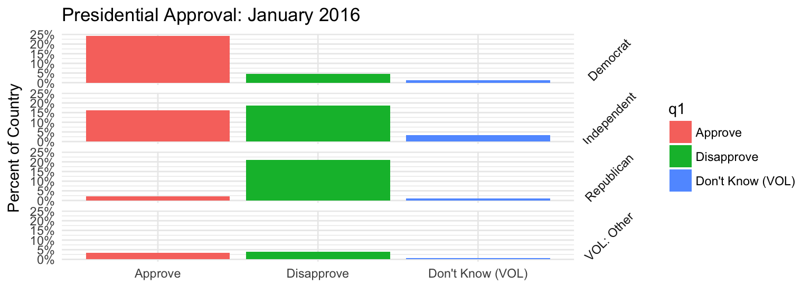

From Data to Document: A Practical Guide to Parameterizing Reports
================
Bay Area R Users Group, November 2017

Tonight's Code via RViews: [http://bit.ly/2AE6En3](https://rviews.rstudio.com/2017/11/07/automating-summary-of-surveys-with-rmarkdown/?utm_content=buffer00098&utm_medium=social&utm_source=twitter.com&utm_campaign=buffer)
============================================================================================================================================================================================================================


<style>
  .col2 {
    columns: 2 200px;         /* number of columns and width in pixels*/
    -webkit-columns: 2 200px; /* chrome, safari */
    -moz-columns: 2 200px;    /* firefox */
    text-align: center;
</style>
Motivation
==========

> -   *Efficiency*: maximize the reusabililty of code, minimize copying and pasting errors
> -   *Reproducibility*: maximize the number of people + computers that can reproduce findings

> -   
>     XKCD 1319

the Recipe
==========

> -   
>     Create a template
> -   
>     Write a loop

Software--seriously, keep up-to-date
====================================

``` r
install.packages("pacman")
p_load(rmarkdown, knitr, questionr, tidyverse, sessioninfo, update = TRUE)
```

Make sure **RStudio** is new enough to get previews


the Data
========

My guide works with four Pew Research Political Surveys: January, March, August, and October 2016. Data are free and easy to download (but account is required).


Configuring the RMarkdown Template
==================================


Building the Template
=====================

### The Template

I find it easiest to write a fully working example and then make little changes as needed so that `knitr::render()` can loop over the data sets. First things first.

``` r
survey <- read.spss("Jan16/Jan16 public.sav", to.data.frame = TRUE)
```

Summary stats can easily be inserted into the text like so.


Making Tables with Kable
========================

``` r
kable(wtd.table(survey$ideo, survey$sex, survey$weight)/nrow(survey), digits = 2)
```

|                   |  Male|  Female|
|-------------------|-----:|-------:|
| Very conservative |  0.04|    0.03|
| Conservative      |  0.14|    0.13|
| Moderate          |  0.20|    0.20|
| Liberal           |  0.08|    0.09|
| Very liberal      |  0.03|    0.03|
| DK\*              |  0.02|    0.03|

Using Kable in a Loop
=====================

``` r
x <- names(survey)[grep("q2[[:digit:]]", names(survey))]
x
```

     [1] "q20"  "q21"  "q22a" "q22b" "q22c" "q22d" "q22e" "q22f" "q22g" "q22h"
    [11] "q22i" "q25"  "q26"  "q27"  "q28" 

``` r
y <- c("ideo", "party")
```

``` r
for (i in x) {
    for (j in y) {
        cat("\nWeighted counts for", i, "broken down by", j, "\n")
        print(kable(wtd.table(survey[[i]], survey[[j]], survey$weight)))  # requires asis=TRUE
        cat("\n")  # break out of table formatting
    }
    cat("\\newpage")
}
```

Adding a plot
=============

``` r
PA <- ggplot(survey) + geom_bar(aes(q1, y = (..count..)/sum(..count..), weight = weight, 
    fill = q1)) + facet_grid(party.clean ~ .)
PA <- PA + theme_minimal() + theme(strip.text.y = element_text(angle = 45)) + 
    xlab("") + scale_y_continuous(labels = scales::percent) + ylab("Percent of Country") + 
    ggtitle("Presidential Approval: January 2016")
PA
```



Adapting the Template with Parameters
=====================================

The next step is to add a [parameter](http://rmarkdown.rstudio.com/developer_parameterized_reports.html) with any variables you need. The parameters will be controlled by the `R` script discussed in a moment.

    params:
      spssfile: !r  1
      surveywave: !r 2016


Parameterizing (cont'd)
=======================

``` r
PA <- PA + ggtitle(paste("Presidential Approval:", params$surveywave))
```

``` r
dir(pattern = ".sav", recursive = TRUE)
```

    [1] "http___www.people-press.org_files_datasets_Aug16/Aug16 public.sav"
    [2] "Jan16/Jan16 public.sav"                                           
    [3] "March16/March16 public.sav"                                       
    [4] "Oct16/Oct16 public.sav"                                           


Automating with knitr
=====================

``` r
library(pacman)
p_load(knitr, rmarkdown, sessioninfo)

setwd("/users/mohanty/Desktop/pewpolitical/")

waves <- c("August 2016", "January 2016", "March 2016", "October 2016")  # for ggtitle, etc.

for (i in 1:length(waves)) {
    render("pewpoliticaltemplate.Rmd", params = list(spssfile = i, surveywave = waves[i]), 
        output_file = paste0("Survey Analysis ", waves[i], ".pdf"))
}

session <- session_info()
save(session, file = paste0("session", format(Sys.time(), "%m%d%Y"), ".Rdata"))
```

A Little Version Control
========================

If a package stops working `install_version` (from `library(devtools)`) installs older versions.

``` r
s <- session_info()
s$platform$version
```

    [1] "R version 3.4.2 (2017-09-28)"

``` r
s$platform$os
```

    [1] "macOS Sierra 10.12.6"

``` r
head(s$packages)
```

     package    * version date       source        
     assertthat   0.2.0   2017-04-11 CRAN (R 3.4.0)
     backports    1.1.1   2017-09-25 CRAN (R 3.4.2)
     bindr        0.1     2016-11-13 CRAN (R 3.4.0)
     bindrcpp     0.2     2017-06-17 CRAN (R 3.4.0)
     broom        0.4.2   2017-02-13 CRAN (R 3.4.0)
     cellranger   1.1.0   2016-07-27 CRAN (R 3.4.0)

Thanks!
=======


